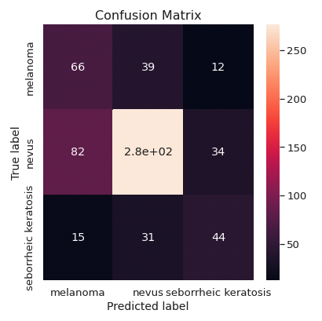
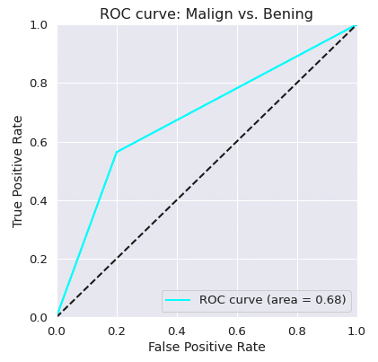
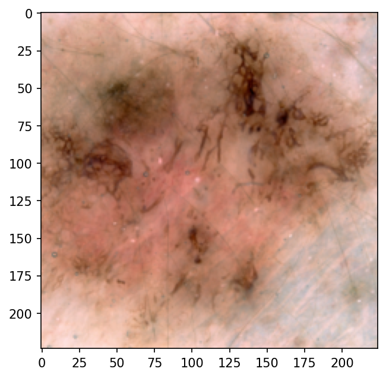
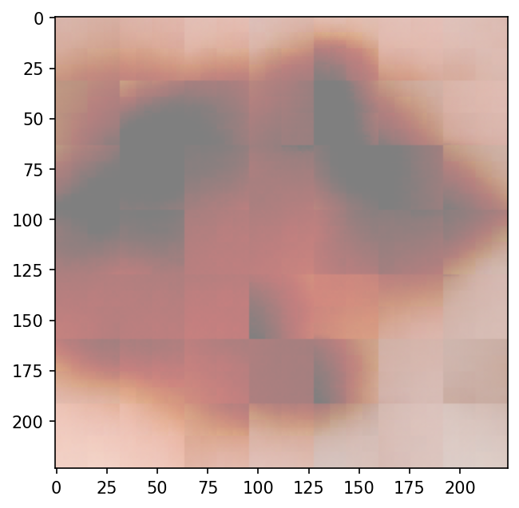

# Dermatologist AI: Skin Cancer Detection with Convolutional Neural Networks (CNNs)

This repository contains the definition and evaluation of a Convolutional Neural Network (CNN) which aims to classify skin lesion images into three categories:

- [Melanoma](https://es.wikipedia.org/wiki/Melanoma): **malign** cancer, one of the deadliest.
- [Nevus](https://en.wikipedia.org/wiki/Nevus): **benign** skin lesion (mole or birthmark).
- [Seborrheic keratosis](https://en.wikipedia.org/wiki/Seborrheic_keratosis): **benign** skin tumor.


Additionally, the images are compressed with an [Autoencoder](https://en.wikipedia.org/wiki/Autoencoder) and visualized using [T-SNE](https://en.wikipedia.org/wiki/T-distributed_stochastic_neighbor_embedding).

Although the [preliminary results](#preliminary-results) are far from good, I think I've built a research framework with which I can easily try new approaches to hopefully improve the outcome -- if I find some time for that...

The motivation of the project comes from two sources that caught my attention:

- The Nature paper by [Esteva et al.](https://www.nature.com/articles/nature21056.epdf?author_access_token=8oxIcYWf5UNrNpHsUHd2StRgN0jAjWel9jnR3ZoTv0NXpMHRAJy8Qn10ys2O4tuPakXos4UhQAFZ750CsBNMMsISFHIKinKDMKjShCpHIlYPYUHhNzkn6pSnOCt0Ftf6), in which the authors show how a CNN architecture based on the [Inception-V3](https://en.wikipedia.org/wiki/Inceptionv3) network achieves a **dermatologist-level classification of skin cancer**.
- The [2017 ISIC Challenge on Skin Lesion Analysis Towards Melanoma Detection](https://challenge.isic-archive.com/landing/2017/).

I decided to try one task of the 2017 ISIC Challenge; to that end, I forked the Github repository [udacity/dermatologist-ai](https://github.com/udacity/dermatologist-ai), which provides som evaluation starter code as well as some hints on the challenge.

Overview of contents:

- [Dermatologist AI: Skin Cancer Detection with Convolutional Neural Networks (CNNs)](#dermatologist-ai-skin-cancer-detection-with-convolutional-neural-networks-cnns)
  - [ISIC Challenge 2017](#isic-challenge-2017)
    - [This Version](#this-version)
    - [Official Challenge Results](#official-challenge-results)
    - [Dataset](#dataset)
  - [Overview and File Structure](#overview-and-file-structure)
    - [How to Use This](#how-to-use-this)
    - [Dependencies](#dependencies)
  - [Skin Cancer Classification CNN and Convolutional Autoencoder](#skin-cancer-classification-cnn-and-convolutional-autoencoder)
  - [Preliminary Results](#preliminary-results)
  - [Possible Improvements](#possible-improvements)
  - [Authorship and License](#authorship-and-license)

## ISIC Challenge 2017

Although the [2017 ISIC Challenge on Skin Lesion Analysis Towards Melanoma Detection](https://challenge.isic-archive.com/landing/2017/) is already closed, information on the challenge can be obtained from the official [website](https://challenge.isic-archive.com/landing/2017/).

The challenge had three parts or tasks:

- Part 1: Lesion Segmentation Task.
- Part 2: Dermoscopic Feature Classification Task.
- **Part 3: Disease Classification Task**.

The present project deals only with the **third part or task**, which is evaluated with the [ROC-AUC](https://en.wikipedia.org/wiki/Receiver_operating_characteristic) of three cases:

1. The binary classification between **benign** (nevus and seborrheic keratosis) vs. **malign** (melanoma),
2. The binary classification between skin lesions of origin in the **melanocyte** skin cells (nevus and melanoma) vs **keratinocyte** skin cells (seborrheic keratosis).
3. The mean of the two above.

### This Version

I have created a model that performs a multi-class classification and computed from its inferences the metrics of the 3 cases, but I have mainly focused on the first case: benign vs. malign. Additionally, I have defined an Autoencoder which generates compressed representations of the images; with them, I have applied a [T-SNE](https://en.wikipedia.org/wiki/T-distributed_stochastic_neighbor_embedding) visualization to the test split.

### Official Challenge Results

The challenge organizers published an interesting summary of the results and insights from the best contributions in [this article](https://arxiv.org/pdf/1710.05006.pdf); some interesting points associated with the third part/task are:

- Top submissions used ensembles.
- Additional data were used to train.
- The classification of seborrheic keratosis seems the easiest task.
- Simpler method led to better performance.

Some of the works that obtained the best results are: 

- Matsunaga K, Hamada A, Minagawa A, Koga H. [“Image Classification of Melanoma, Nevus and Seborrheic Keratosis by Deep Neural Network Ensemble”](https://arxiv.org/ftp/arxiv/papers/1703/1703.03108.pdf). 
- Díaz IG. [“Incorporating the Knowledge of Dermatologists to Convolutional Neural Networks for the Diagnosis of Skin Lesions”](https://arxiv.org/pdf/1703.01976.pdf). [**Code**](https://github.com/igondia/matconvnet-dermoscopy).
- Menegola A, Tavares J, Fornaciali M, Li LT, Avila S, Valle E. [“RECOD Titans at ISIC Challenge 2017”](https://arxiv.org/abs/1703.04819). [**Code**](https://github.com/learningtitans/isbi2017-part3).

### Dataset

I downloaded the dataset from the links provided by Udacity to the non-committed folder `data/`, which is subdivided in the train, validation and test subfolders as well as class-name subfolders:

- [training data](https://s3-us-west-1.amazonaws.com/udacity-dlnfd/datasets/skin-cancer/train.zip) (5.3 GB)
- [validation data](https://s3-us-west-1.amazonaws.com/udacity-dlnfd/datasets/skin-cancer/valid.zip) (824.5 MB)
- [test data](https://s3-us-west-1.amazonaws.com/udacity-dlnfd/datasets/skin-cancer/test.zip) (5.1 GB)

The images originate from the [ISIC Archive](https://www.isic-archive.com/).

## Overview and File Structure

The project folder contains the following files:

```
skin_lesion_classification.ipynb        # Project notebook 1: Classification
dataset_structure_visualization.ipynb   # Project notebook 2: T-SNE Visualization
README.md                               # Current file
Instructions.md                         # Original project instructions from Udacity
data/                                   # Dataset
images/                                 # Auxiliary images
requirements.txt                        # Dependencies
results.csv                             # My results with the model from notebook 1
LICENSE.txt                             # License
models/                                 # (Uncommitted) Models folder
get_results.py                          # (Unused) Script for generating a ROC plot + confusion matrix
ground_truth.csv                        # (Unused) True labels wrt. 3 cases/tasks of part 3
sample_predictions.csv                  # (Unused) Example output wrt. 3 cases/tasks of part 3
```

The most important files are the notebooks, which contain the complete project development. The dataset is contained in `data/`, but images are not committed.

Note that there are some *unused* files that come from the forked repository; the original [`Instructions.md`](Instructions.md) explain their whereabouts.

### How to Use This

Install the [dependencies](#dependencies) and open the notebooks, which can be run independently and from start to end:

- [`skin_lesion_classification.ipynb`](skin_lesion_classification.ipynb): CNN model definition, training and evaluation with frozen [ResNet50](https://en.wikipedia.org/wiki/Residual_neural_network) as backbone.
- [`dataset_structure_visualization.ipynb`](dataset_structure_visualization.ipynb): Convolutional Autoencoder definition and training; the encoder is used to generate compressed image representations, which are used to visualize the dataset applying [T-SNE](https://en.wikipedia.org/wiki/T-distributed_stochastic_neighbor_embedding).

Note that if you run the notebooks from start to end you'll start training the models at some point, which might take several hours (each model took 6-8 hours on my Macbook Pro 2021 M1 with the current settings).

The project has a strong research character; the code is not production ready yet :wink:

### Dependencies

A short summary of commands required to have all in place with [conda](https://docs.conda.io/en/latest/):

```bash
conda create -n derma python=3.6
conda activate derma
conda install pytorch torchvision -c pytorch 
conda install pip
pip install -r requirements.txt
```

## Skin Cancer Classification CNN and Convolutional Autoencoder

The following picture shows the two models defined in each of the notebooks. The first is a convolutional **classifier** based on [ResNet50](https://en.wikipedia.org/wiki/Residual_neural_network) which is used for estimating the type skin lesion. The second is a convolutional **autoencoder** which is trained to encode (compress) and decode (expand) images so that the input and expanded images are as similar as possible.


## Preliminary Results

Both models are rather simple and produce, in consequence, very bad results; however, the research framework is now built to explore more appropriate approaches, as outlined in the [improvements section](#possible-improvements) :wink:

**Classifier**

- The classifier has a ROC-AUC of 0.53 for the simplified classification benign vs. malign.
- Most of the melanoma cases are predicted as other types of skin lesions.
- Seborrheic keratosis is often predicted as nevus.
- This is a nice example of why the accuracy metric is really bad for such inbalanced classification problems; even though the accuracy scores 70%, the recall for the malign vs. benign case is 0.07.


<table cellspacing="0" cellpadding="0" style="border-collapse: collapse; border: none;">
<tr >
<td style="border: none;">

<p align="center">
  
</p>

</td>
<td style="border: none;">

<p align="center">
  
</p>

</td>
</tr>
</table>

**Autoencoder & T-SNE**

- The autoencoder is not able to meaningfully compress the images, and hence, the encoded image representations are not 
- The autoencoder is biased: it underfits the dataset, because the learning curves decrease fast at the begining and don't change much later on.
- The transformed images are quite different/low resolution compared to the original ones; it's difficult for the compressed representations to contain enough information to distinguish between classes.
- The transpose convolutions create checkerboard artifacts, as reported by [Odena et al.](https://distill.pub/2016/deconv-checkerboard/).
- As expected, the T-SNE transformation in 2D doesn't shown clearly differentiated point clusters.


<table cellspacing="0" cellpadding="0" style="border-collapse: collapse; border: none;">
<tr >
<td style="border: none;">

<p align="center">
  <p align="center">Input to Autoencoder</p>
  
</p>

</td>
<td style="border: none;">

<p align="center">
  <p align="center">Output from Autoencoder</p>
  
</p>

</td>
</tr>
</table>


<p align="center">
  
</p>


## Possible Improvements

**Classifier**

- [ ] Similarly as [Esteva et al.](https://www.nature.com/articles/nature21056.epdf?author_access_token=8oxIcYWf5UNrNpHsUHd2StRgN0jAjWel9jnR3ZoTv0NXpMHRAJy8Qn10ys2O4tuPakXos4UhQAFZ750CsBNMMsISFHIKinKDMKjShCpHIlYPYUHhNzkn6pSnOCt0Ftf6) did, I should fine tune the backbone, i.e., the weights of the backbone should be optimized for the dataset, too.

**Autoencoder & T-SNE**

- [ ] Add more depth to the filters.
- [ ] Add linear layers in the bottleneck.
- [ ] Increase the number of parameters one order of magnitude and see if the behavior improves (i.e., 7M parameters).
- [ ] Use *upsampling* instead of transpose convolution (to solve the checkerboard artifacts). [Example](https://github.com/mxagar/deep-learning-v2-pytorch/tree/master/autoencoder/convolutional-autoencoder).
- [ ] It probably makes more sense to use the train split for the T-SNE visualization; however, I would need to set shuffle=False in the data loader to be able to track sample filenames easily.
- [ ] If the T-SNE visualization shows distinct clusters, I can try to find similar images simply by using the dot product distance between image vectors.

## Authorship and License

This repository was forked from [udacity/dermatologist-ai](https://github.com/udacity/dermatologist-ai) and modified to the present status following the original [license](LICENSE.txt) from Udacity. Note that the substantial content doesn't come from Udacity.

Mikel Sagardia, 2022.  
No guarantees.

